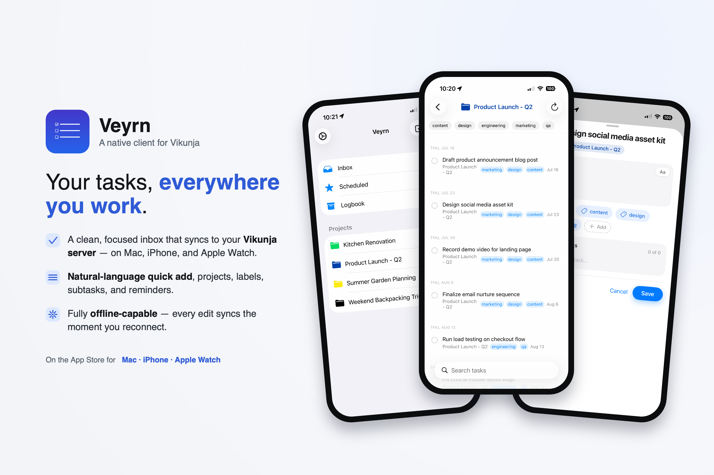

# Veyrn



A Things 3-style task management app for macOS, iOS, and watchOS that connects to any [Vikunja](https://vikunja.io) instance — self-hosted or Vikunja Cloud.

Latest Release Available on the [App Store](https://apps.apple.com/us/app/veyrn/id6764057920).

Beta Builds Available on [TestFlight](https://testflight.apple.com/join/q8GhTkFz) 

<p>
  
</p>

## Features

- **Full task management** — create, edit, complete, and reopen tasks
- **Subtasks** — inline checklist with progress badge, add subtasks directly from the task editor
- **Inbox, Scheduled, Logbook, and Projects** sidebar, similar to Things 3
- **Project and label colors** — hex color tinting throughout the UI for projects and label chips
- **WidgetKit extension** for macOS and iOS showing upcoming tasks grouped by date, including Lock Screen and StandBy widgets (accessory families: rectangular, circular, inline)
- **Quick Add** with a natural-language parser: `*tag`, `+project`, `!priority`, dates like `tomorrow`, `next monday`, `in 3 days`, and recurrence like `every week` — with a reminder chip to set a reminder right at creation time
- **Bulk import** — paste or drag in a plain-text list of tasks
- **Rich text notes** — Vikunja's HTML task descriptions, with bold/italic/links/bullets
- **Offline mode** — an outbox queues changes and drains when you're back online
- **Multiple accounts** — up to 5 Vikunja accounts (same server or different ones), switched from Settings
- **API tokens in the system Keychain**, shared across app, widgets, and Watch
- **macOS global hotkey** — system-wide Quick Add panel
- **iOS Home Screen Quick Actions** — jump straight to New Task or Scheduled
- **Reminders** — synced to the system notification center
- **Apple Watch app** — Scheduled (7-day window) and Inbox views, tap to complete, dictation/Scribble Quick Add with confirm-chips screen; credentials pushed from the phone over WatchConnectivity
- **Apple Watch Smart Stack widget** — complications and Smart Stack widget showing upcoming tasks
- **Report a Bug** — in-app bug reports with an optional diagnostic log, readable in full before sending; the log never contains hosts, tokens, or task content
- **Vikunja API v2** used for the task fetch when the server supports it (2.4.0+), with automatic fallback to v1
- **Opt-out analytics** — TelemetryDeck integration (on by default; user-toggled in Settings)

## Requirements

- A running [Vikunja](https://vikunja.io) instance — self-hosted or Vikunja Cloud
- A Vikunja API token (Settings → API Tokens in your Vikunja web UI)
- An Apple Developer account (paid, for signing)
- Xcode 16+
- [xcodegen](https://github.com/yonaskolb/XcodeGen): `brew install xcodegen`

## Getting Started

### 1. Clone the repo

```bash
git clone https://github.com/scottsapps/Vikunja-Tasks.git
cd Vikunja-Tasks
```

### 2. Change the identifiers

See [Forking: identifiers you must change](#forking-identifiers-you-must-change) below. Do this before your first build — several of these are baked into entitlements, and getting them wrong produces an app that builds cleanly and then silently can't read its own data.

### 3. Create your signing config

Create `Signing.xcconfig` at the repo root (it's git-ignored):

```
DEVELOPMENT_TEAM = XXXXXXXXXX
CODE_SIGN_STYLE = Automatic
```

Replace `XXXXXXXXXX` with your 10-character Apple Developer Team ID, found in Xcode → Settings → Accounts → click your team → Team ID column.

The build number lives in `project.yml` (`CURRENT_PROJECT_VERSION`, under `settings.base`), **not** here and not in Xcode's UI — project settings override the xcconfig, and editing it in Xcode only touches the generated `.xcodeproj`, which the next `make gen` overwrites. Bump it there before each TestFlight/App Store upload.

### 4. Replace the TelemetryDeck identifiers

The app uses [TelemetryDeck](https://telemetrydeck.com) for opt-out analytics (on by default, user-toggled in Settings). Two values in `VikunjaWidgetApp/VeyrnTelemetry.swift` are specific to this project:

```swift
TelemetryDeck.Config(appID: "YOUR-APP-ID-HERE")
config.defaultParameters = { ["namespace": "your.namespace"] }
```

You can create a free TelemetryDeck account and get an App ID at [telemetrydeck.com](https://telemetrydeck.com). Alternatively, remove the `TelemetryDeck` package from `project.yml` and delete `VeyrnTelemetry.swift` and its call sites to ship without analytics entirely.

### 5. Generate the Xcode project

```bash
make gen
```

Always use `make gen` rather than running xcodegen directly — the Makefile regenerates the six entitlements files after each xcodegen run (xcodegen writes them empty). This also means **the entitlements files themselves are generated output: edit the Makefile, never the `.entitlements` files.**

### 6. Open and build

```bash
open VikunjaWidget.xcodeproj
```

Select the `VikunjaWidgetApp` scheme for macOS, `VikunjaWidgetAppIOS` for iOS, or `VikunjaWidgetWatch` for the Watch app, then build and run.

### 7. Configure the app

On first launch, go to Settings and enter:
- A name for the account
- Your Vikunja instance URL (e.g. `https://tasks.example.com`) or Vikunja Cloud
- Your Vikunja API token

## Forking: identifiers you must change

Start here — it finds most of them:

```bash
grep -rn "net\.angstreich" --include="*.swift" --include="*.plist" . project.yml Makefile
```

**Required.** Miss any of these and the app misbehaves, usually without an error:

| What | Where |
|---|---|
| Bundle ID prefix | `project.yml` — `bundleIdPrefix`, plus the six explicit `PRODUCT_BUNDLE_IDENTIFIER` lines |
| Bundle IDs in plists | `VikunjaWidgetApp/Info.plist`, `VikunjaWidgetApp/InfoIOS.plist` (`CFBundleIdentifier`) |
| **App Group** | `Makefile` (written into all six entitlements files), `VikunjaCore/VikunjaConfig.swift` (`appGroupSuite`), `VikunjaCore/WidgetCache.swift` (`suiteName`) |
| **Keychain access group** | `Makefile` (all six entitlements) |
| **Keychain service** | `VikunjaCore/TokenStore.swift` (`service`) |
| Background refresh task id | `VikunjaWidgetApp/BackgroundRefresh.swift` (`taskId`) **and** `InfoIOS.plist` (`BGTaskSchedulerPermittedIdentifiers`) — these two must match |
| iOS Quick Action types | `VikunjaWidgetApp/VikunjaWidgetApp.swift` (two `case` strings) **and** `InfoIOS.plist` (`UIApplicationShortcutItems`) — must match |
| Watch companion app | `VikunjaWidgetWatch/Info.plist` (`WKCompanionAppBundleIdentifier`) — must be your iOS app's bundle ID |
| **Bug report email** | `VikunjaWidgetApp/BugReportMail.swift` (`supportAddress`) — otherwise your users' bug reports come to *me* |
| TelemetryDeck App ID + namespace | `VikunjaWidgetApp/VeyrnTelemetry.swift` |

The three in bold are the ones that fail silently. The App Group and Keychain access group are written by the **Makefile**, not by `project.yml`, so changing the bundle prefix alone leaves them pointing at this project — the app builds, launches, and then can't share credentials or cached tasks with its own widgets.

**Cosmetic**, safe to leave: dispatch queue labels (`DiagnosticLog.swift`, `HangWatchdog.swift`), `Notification.Name` strings (`ShortcutRouter.swift`, `HotkeyRecorderView.swift`), the `Logger` subsystem in `CompleteTaskIntent.swift`, and the `vikunja://` / `veyrn://` URL schemes in the plists (only worth changing if you'd otherwise clash with an installed copy of Veyrn).

## Project Structure

```
VikunjaCore/                 Shared code — models, API client, config, parser, offline outbox, logging
VikunjaWidgetApp/            App target sources (macOS + iOS, platform-conditional)
VikunjaWidgetExtension/      Widget extension sources (shared by macOS and iOS widget targets)
VikunjaWidgetWatch/          Apple Watch app (standalone; online-only)
VikunjaWidgetWatchExtension/ Watch widget extension (Smart Stack + face complications)
project.yml                  XcodeGen project definition
Makefile                     Wraps xcodegen + regenerates entitlements
```

> **Note on naming:** The project started as a widget-only app, so internal identifiers (`VikunjaWidget.xcodeproj`, scheme names, bundle IDs, folder names) still use the `VikunjaWidget` prefix. The user-facing name is Veyrn.

The Watch targets compile only a **subset** of `VikunjaCore`, listed explicitly in each target's `includes:` array in `project.yml`. If Watch code references a Core file that isn't in that list, the build fails with "cannot find … in scope" — add the file to the array.

### Key files

| File | Purpose |
|---|---|
| `VikunjaCore/VikunjaAPI.swift` | API client. All requests go through one `send(_:)` chokepoint that validates status and logs |
| `VikunjaCore/VikunjaConfig.swift` | Multi-account model; host in the App Group, tokens in the Keychain |
| `VikunjaCore/TokenStore.swift` | Keychain wrapper, keyed by account id |
| `VikunjaCore/QuickAddParser.swift` | Natural-language task parser |
| `VikunjaCore/Outbox.swift` | Persistent offline operation queue (per account) |
| `VikunjaCore/TaskMerger.swift` | Reconciles server state with pending outbox ops |
| `VikunjaCore/DiagnosticLog.swift` | Rolling on-device log; App Group storage, one file per process kind |
| `VikunjaWidgetApp/TaskStore.swift` | Observable view-model; owns refresh, create, complete, undo, account switching |
| `VikunjaWidgetApp/AppRoot.swift` | Root view; NavigationSplitView (Mac/iPad) or NavigationStack (iPhone) |
| `VikunjaWidgetApp/BugReportMail.swift` | Report-a-Bug mail composition (MessageUI on iOS, NSSharingService on macOS) |
| `VikunjaWidgetApp/HangWatchdog.swift` | Detects an unresponsive main thread; ignores process suspension |

## Vikunja API Notes

- **v1 is used for everything except the undone-task fetch.** On servers reporting 2.4.0+, that one call uses v2's paged `GET /tasks`; anything else falls back automatically.
- **v1 has no working "all tasks" endpoint** (`/tasks/all` is broken), so the fallback fetches per-project and merges. That fan-out is bounded to 4 concurrent requests, with one retry per project.
- **Send the full task object on every mutation.** Vikunja's Go server treats any omitted field as zero-valued, so a partial body silently wipes unrelated fields — adding a reminder with no `due_date` in the body erases the due date. Clear a due date with the `0001-01-01T00:00:00Z` sentinel rather than by omitting it.
- Due dates are stored as midnight UTC; this is intentional and renders as the previous evening in western timezones.
- The widgets serve from a local App Group cache when it's under 15 minutes old, and fall back to a stale cache rather than showing nothing.

## Building Without Signing (CI / Sanity Check)

Simulator names drift between Xcode releases — check `xcrun simctl list devices` and substitute whatever you actually have installed.

```bash
# macOS
xcodebuild -project VikunjaWidget.xcodeproj -scheme VikunjaWidgetApp \
  -destination 'platform=macOS' build \
  CODE_SIGN_IDENTITY=- CODE_SIGNING_REQUIRED=NO CODE_SIGNING_ALLOWED=NO

# iOS Simulator
xcodebuild -project VikunjaWidget.xcodeproj -scheme VikunjaWidgetAppIOS \
  -destination 'platform=iOS Simulator,name=iPhone 17 Pro' build \
  CODE_SIGN_IDENTITY=- CODE_SIGNING_REQUIRED=NO CODE_SIGNING_ALLOWED=NO

# watchOS Simulator
xcodebuild -project VikunjaWidget.xcodeproj -scheme VikunjaWidgetWatch \
  -destination 'platform=watchOS Simulator,name=Apple Watch Series 11 (46mm)' build \
  CODE_SIGN_IDENTITY=- CODE_SIGNING_REQUIRED=NO CODE_SIGNING_ALLOWED=NO
```

Note that an unsigned build gets **no entitlements**, so the Keychain and App Group are unavailable — it's a compile check, not a functional one.

## Gotchas

- The macOS widget disappears when run from Xcode; archive and install into `/Applications` to see it. After installing a new build, a widget can render as ghosted placeholder bars until deleted and re-added — `killall chronod` clears it.
- `List` is broken in widget extensions — use `VStack`.
- Every `SecItem` query must set `kSecUseDataProtectionKeychain`. Without it, macOS writes to the legacy file-based keychain where the access-group entitlement doesn't apply, and the widget silently reads stale data instead of erroring.
- `Form` on macOS promotes each field's placeholder into a leading label column — use a plain `VStack` for cross-platform field layouts.
- macOS has no `swipeActions`; any row action that matters there needs a visible control.

## Deployment Targets

- macOS 14.0+
- iOS 17.0+
- watchOS 10.0+

## Bugs & Feedback

In the app: **Settings → Report a Bug**, which lets you attach a diagnostic log (readable in full before you send it). Or email scottsapps at protonmail dot com.

## Support

If you find Veyrn useful, you can buy me a [coffee](https://ko-fi.com/scott63157).

## License

See [LICENSE](LICENSE).
