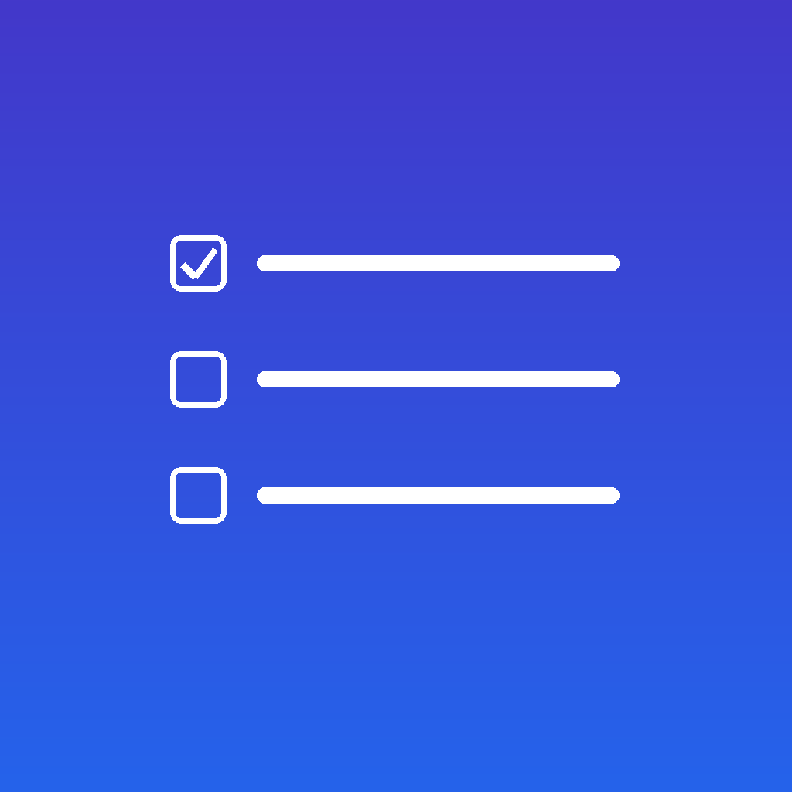

# Veyrn

A Things 3-style task management app for macOS and iOS that connects to a self-hosted [Vikunja](https://vikunja.io) instance.

Available on the [App Store](https://apps.apple.com/us/app/veyrn/id6764057920).

<p>
  
</p>

## Features

- **Full task management** — create, edit, complete, and reopen tasks
- **Inbox, Scheduled, Logbook, and Projects** sidebar, similar to Things 3
- **WidgetKit extension** for macOS and iOS showing upcoming tasks grouped by date
- **Quick Add** with a natural-language parser: `*tag`, `+project`, `!priority`, dates like `tomorrow`, `next monday`, `in 3 days`, and recurrence like `every week`
- **Bulk import** — paste or drag in a plain-text list of tasks
- **Rich text notes** — Vikunja's HTML task descriptions, with bold/italic/links/bullets
- **Offline mode** — an outbox queues changes and drains when you're back online
- **macOS global hotkey** — system-wide Quick Add panel
- **iOS Home Screen Quick Actions** — jump straight to New Task or Scheduled
- **Reminders** — synced to the system notification center
- **Apple Watch app** — Scheduled (7-day window) and Inbox views, tap to complete, dictation/Scribble Quick Add with confirm-chips screen; credentials pushed from the phone over WatchConnectivity

## Requirements

- A running [Vikunja](https://vikunja.io) instance (self-hosted)
- A Vikunja API token (Settings → API Tokens in your Vikunja web UI)
- An Apple Developer account (paid, for signing)
- Xcode 16+
- [xcodegen](https://github.com/yonaskolb/XcodeGen): `brew install xcodegen`

## Getting Started

### 1. Clone the repo

```bash
git clone https://github.com/scottsapps/Vikunja-Tasks.git
cd Vikunja-Tasks
```

### 2. Set your bundle identifier

Open `project.yml` and replace `net.angstreich` with your own reverse-domain prefix (e.g. `com.yourname`):

```yaml
bundleIdPrefix: com.yourname        # was net.angstreich
```

You'll also need to update the explicit `PRODUCT_BUNDLE_IDENTIFIER` lines in the same file for the widget extension and Watch targets, and the App Group identifier in `VikunjaCore/VikunjaConfig.swift` and `VikunjaCore/WidgetCache.swift`:

```swift
static let appGroupSuite = "group.com.yourname.VikunjaWidgetApp"
```

And in both `VikunjaWidgetApp/Info.plist` and `VikunjaWidgetApp/InfoIOS.plist`, update the bundle identifier and URL scheme strings to match.

### 3. Create your signing config

Create `Signing.xcconfig` at the repo root (it's git-ignored):

```
DEVELOPMENT_TEAM = XXXXXXXXXX
CODE_SIGN_STYLE = Automatic
CURRENT_PROJECT_VERSION = 1
```

Replace `XXXXXXXXXX` with your 10-character Apple Developer Team ID, found in Xcode → Settings → Accounts → click your team → Team ID column. Increment `CURRENT_PROJECT_VERSION` before each TestFlight/App Store upload — keeping it here means `make gen` never resets it.

### 4. Generate the Xcode project

```bash
make gen
```

Always use `make gen` rather than running xcodegen directly — the Makefile regenerates the five entitlements files after each xcodegen run (xcodegen writes them empty).

### 5. Open and build

```bash
open VikunjaWidget.xcodeproj
```

Select the `VikunjaWidgetApp` scheme for macOS, `VikunjaWidgetAppIOS` for iOS, or `VikunjaWidgetWatch` for the Watch app, then build and run.

### 6. Configure the app

On first launch, go to Settings and enter:
- Your Vikunja instance URL (e.g. `https://tasks.example.com`)
- Your Vikunja API token

## Project Structure

```
VikunjaCore/            Shared code — models, API client, config, parser, offline outbox
VikunjaWidgetApp/       App target sources (macOS + iOS, platform-conditional)
VikunjaWidgetExtension/ Widget extension sources (shared by macOS and iOS widget targets)
VikunjaWidgetWatch/     Apple Watch app (standalone; online-only)
project.yml             XcodeGen project definition
Makefile                Wraps xcodegen + regenerates entitlements
```

> **Note on naming:** The project started as a widget-only app, so internal identifiers (`VikunjaWidget.xcodeproj`, scheme names, bundle IDs, folder names) still use the `VikunjaWidget` prefix. The user-facing name is Veyrn.

### Key files

| File | Purpose |
|---|---|
| `VikunjaCore/VikunjaAPI.swift` | API client — fetches tasks/projects/labels, completes tasks |
| `VikunjaCore/VikunjaConfig.swift` | Reads host + API token from the shared App Group UserDefaults |
| `VikunjaCore/QuickAddParser.swift` | Natural-language task parser |
| `VikunjaCore/Outbox.swift` | Persistent offline operation queue |
| `VikunjaCore/TaskMerger.swift` | Reconciles server state with pending outbox ops |
| `VikunjaWidgetApp/TaskStore.swift` | Observable view-model; owns refresh, create, complete, undo |
| `VikunjaWidgetApp/AppRoot.swift` | Root view; NavigationSplitView (Mac/iPad) or NavigationStack (iPhone) |

## Vikunja API Notes

- The app fetches tasks per-project in parallel — `/tasks/all` is broken in some Vikunja versions
- Completing or reopening a task requires a full PUT with `done` flipped — partial bodies wipe other fields
- Due dates are stored as midnight UTC; this is intentional
- The widget falls back to a local App Group cache when the network is unavailable

## Building Without Signing (CI / Sanity Check)

```bash
# macOS
xcodebuild -project VikunjaWidget.xcodeproj -scheme VikunjaWidgetApp \
  -destination 'platform=macOS' build \
  CODE_SIGN_IDENTITY=- CODE_SIGNING_REQUIRED=NO CODE_SIGNING_ALLOWED=NO

# iOS Simulator
xcodebuild -project VikunjaWidget.xcodeproj -scheme VikunjaWidgetAppIOS \
  -destination 'platform=iOS Simulator,name=iPhone 16 Pro' build \
  CODE_SIGN_IDENTITY=- CODE_SIGNING_REQUIRED=NO CODE_SIGNING_ALLOWED=NO

# watchOS Simulator
xcodebuild -project VikunjaWidget.xcodeproj -scheme VikunjaWidgetWatch \
  -destination 'platform=watchOS Simulator,name=Apple Watch Series 10 (46mm)' build \
  CODE_SIGN_IDENTITY=- CODE_SIGNING_REQUIRED=NO CODE_SIGNING_ALLOWED=NO
```

## Deployment Targets

- macOS 14.0+
- iOS 17.0+
- watchOS 10.0+

## License

See [LICENSE](LICENSE).
